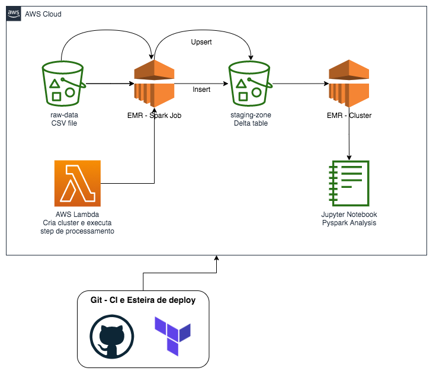

# Bootcamp Engenheiro(a) de Dados Cloud - IGTI - Módulo 1

## Fundamentos de Arquitetura de Dados em Nuvem

#### Anderson Theobaldo

Repositório com códigos e esteiras de deploy para as atividades do módulo 1 do bootcamp **Engenheiro de Dados Cloud** do IGTI. 

# Use Cases a serem trabalhos

## 1 - Delta Lake com EMR

Arquitetura da solução:

